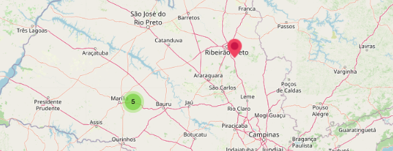

# React Leaflet Muster

> A modern study React wrapper of marker cluster for react-leaflet

React wrapper of [Leaflet.markercluster](https://github.com/Leaflet/Leaflet.markercluster)
for [react-leaflet](https://github.com/PaulLeCam/react-leaflet)
based in [react-leaflet-markercluster](https://github.com/yuzhva/react-leaflet-markercluster)



## Table of contents

- [Main](#main)
- [Getting started](#getting-started)
- [API](#api)
- [Credits](#credits)
- [License](#license)

## Main

```text
dist/
└── index.min.js    
```

## Getting started

### Requirements

```shell
yarn add leaflet leaflet.markercluster react-leaflet
```

### Installation

#### For React 17 with React Leaflet 3

```shell
yarn add react-leaflet-muster@ˆ1.0.3
```

#### For React 18 with React Leaflet 4

```shell
yarn add react-leaflet-muster@^2.0.1
```

### Usage

#### Basic Example

```jsx
<MarkerMuster>
    <Marker position={[-21.210309, -47.647063]}/>
    <Marker position={[-21.210309, -47.647063]}/>
</MarkerMuster>
```

#### Full Example

```jsx
import "leaflet/dist/leaflet.css";

import { MarkerMuster } from "react-leaflet-muster";
import { MapContainer, TileLayer, Marker } from "react-leaflet";

function Map() {
    return(
        <MapContainer
            zoom={14}
            center={[-22.2108112, -49.6771926]}
        >
            <TileLayer
                url="https://{s}.tile.openstreetmap.org/{z}/{x}/{y}.png"
            />
            <MarkerMuster>
                <Marker position={[-21.210309, -47.647063]}/>
                <Marker position={[-21.210309, -47.647063]}/>
            </MarkerMuster>
        </MapContainer>
    )
}
```

## API

You can see the properties in [Leaflet.markercluster All Options](https://github.com/Leaflet/Leaflet.markercluster#all-options)

#### Example options

```jsx
<MarkerMuster
    showCoverageOnHover={false}
    zoomToBoundsOnClick={false}
>
    <Marker position={[-21.210309, -47.647063]}/>
    <Marker position={[-21.210309, -47.647063]}/>
</MarkerMuster>
```

#### Example listeners

```jsx
<MarkerMuster
    onCLick={e => console.log(e)}
    onMouseOver={e => console.log(e)}
>
    <Marker position={[-21.210309, -47.647063]}/>
    <Marker position={[-21.210309, -47.647063]}/>
</MarkerMuster>
```


## Credits

All credits and rights to [Yevhen Uzhva](https://github.com/yuzhva)
of [react-leaflet-markercluster](https://github.com/yuzhva/react-leaflet-markercluster)

## License
[ISC](https://opensource.org/licenses/ISC) © [Giovane Santos](https://giovanesantossilva.github.io/)
